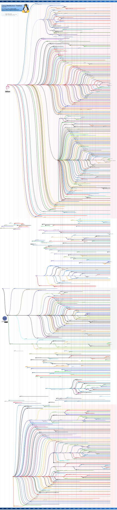

## Debian 是什么
[Debian](http://www.debian.org)（英语发音：/ˈdɛbiən/）是由[GPL](https://zh.wikipedia.org/wiki/GPL)和其他自由软件许可协议授权的自由软件组成的操作系统，由Debian项目（Debian Project）组织维护。Debian项目是一个独立的、分散的组织，由3000+人志愿者组成，接受世界多个非盈利组织的资金支持，[Software in the Public Interest](https://en.wikipedia.org/wiki/Software_in_the_Public_Interest)提供支持并持有商标作为保护机构。

Debian是一个大的系统组织框架，在这个框架下有多种不同操作系统核心的分支计划，主要为采用Linux核心的Debian GNU/Linux系统，其他还有采用GNU Hurd核心的Debian GNU/Hurd系统、采用FreeBSD核心的Debian GNU/kFreeBSD系统，以及采用NetBSD核心的Debian GNU/NetBSD系统。甚至还有应用Debian的系统架构和工具，采用OpenSolaris核心构建而成的Nexenta OS系统。**在这些Debian系统中，以采用Linux核心的Debian GNU/Linux最为著名**。众多的Linux发行版，例如Ubuntu、Kali、Knoppix和Linspire及Xandros、deepin等，都建基于Debian GNU/Linux。

Debian 同时维护 3 种不同的发行版。 它们是:
- stable — 最广泛的用于架设产品化服务器,因为它只包含安全更新。
- testing — 推荐工作站用户使用的发行版,因为它包含有最近发布的桌面软件,这些软件已经接受了少量测试。
- unstable — 处在悬崖边缘的版本,供 Debian 开发者选用。如果 unstable 发行版中的软件包不再出现 Release Critical(RC) 错误,大概一周后,它将自动升级到 testing 发行版。

它们的详细内容请见后续章节.

既然简单的介绍了Debian,那么不妨看看linux世界三巨头的家族树.

