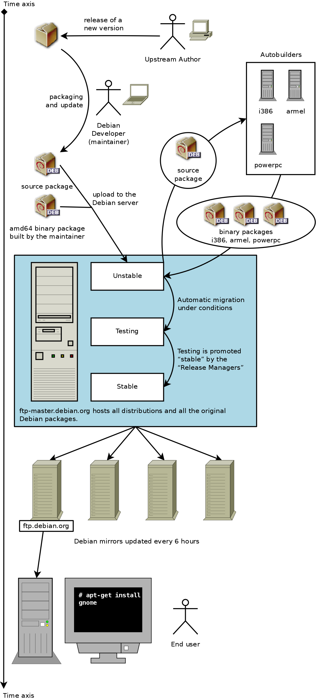

## Debian 发行版

Debian 一直维护着至少三个发行版: 稳定版(stable)，测试版(testing) 和 不稳定版(unstable)。

+ **稳定版(stable)**
> **稳定版**包含了 Debian 官方最近一次发行的软件包。
作为 Debian 的正式发行版本，它是我们优先推荐给用户您选用的版本。

+ **测试版(testing)**
> **测试版**包含了那些暂时未被收录进入稳定版的软件包，但它们已经进入了候选队列。使用这个版本的最大益处在于它拥有更多版本较新的软件。
**测试版**版本代号永远是 testing。(当 testing 发行版足够成熟了,它会冻结发行版,表示这个版本不再加入新代码,只进行除错工作。同时,dists 目录中会建立新的 testing 发行版目录树,并命名新的版本代号。)

+ **不稳定版(unstable)**
> **不稳定版**存放了 Debian 现行的开发工作。通常，只有开发者和那些喜欢过惊险刺激生活的人选用该版本。
**不稳定版**的版本代号永远都被称为 sid。

## Debian 生命周期

Debian将同时具有三至六个不同的版本，实验(Experimental)，不稳定(Unstable)，测试(Testing)，稳定(Stable)，上个稳定版(oldStable)，甚至上上个稳定版(oldoldStable)。每一个对应于发展的不同阶段。如果想有很好的理解，我们来看看一个程序的旅程，从最初的包装到Debian的稳定版本。

在Unstable中的状态也是非常有趣的，维护者创建初始源码包，他们上传自己维护构建的包到Debian的服务器。该软件可以使用但不是稳定版本，这时候大家发现该程序，然后进行测试。
如果他们遇到的bug，他们报告给包的维护者。维护者然后定期编写修正版本，然后将它们上传到服务器。

Debian在漫长的时间长河中总结出一套完整的体系来保持自己的包的稳定性。毕竟经得起时间考验的才是最好的！

Debian每一个稳定的版本有大约5年的预期寿命，因为释放一个稳定版往往需要2年，当一个新的稳定版本出现，前者的释放版本变成oldstable甚至成为前Oldoldstable。

## Debian 社区角色
在 Debian 社区中有这几类常见的角色：

- Upstream author (上游作者)：程序的原始作者。

- Upstream maintainer (上游维护者)：目前在上游维护程序代码的人。

- Maintainer (软件包维护者)：制作并维护该程序 Debian 软件包的人。

- Sponsor (赞助者)：帮助维护者上传软件包到 Debian 官方仓库的人（在通过内容检查之后）。

- Mentor (导师)：帮助新手维护者熟悉和深入打包的人。

- Debian Developer (DD，Debian开发者)：Debian 社区的官方成员。DD 拥有向 Debian 官方仓库上传的全部权限。

- Debian Maintainer (DM，Debian维护者)：拥有对 Debian 官方仓库部分上传权限的人。

注意，你不可能在一夜之间成为 Debian Developer，因为成为 DD 所需要的远不只是技术技巧。不过别因此而气馁，如果你的软件包对其他人有用，你可以当这个软件包的 Maintainer，然后通过一位 Sponsor 来上传这份软件，或者你可以申请成为 Debian Maintainer。