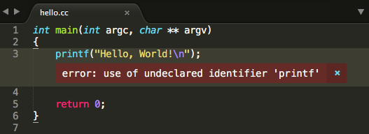
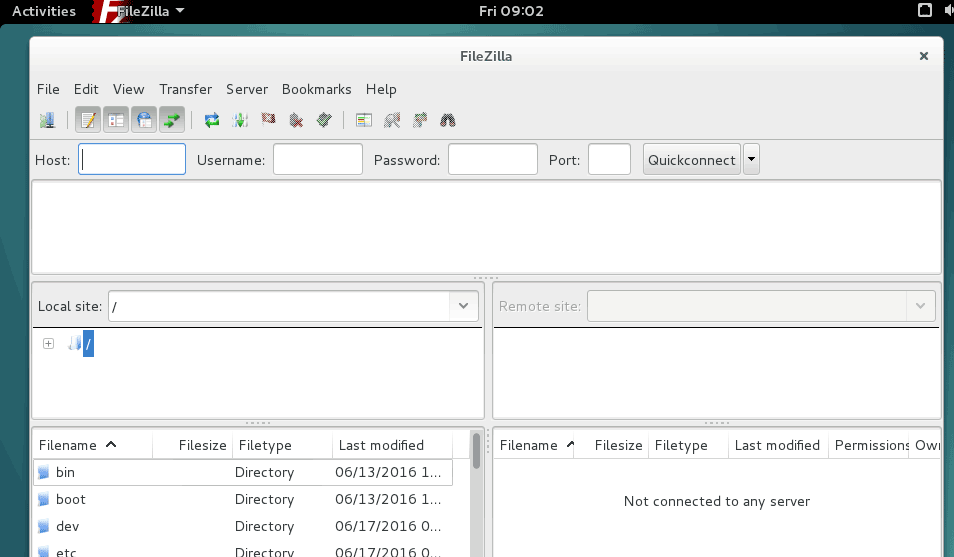
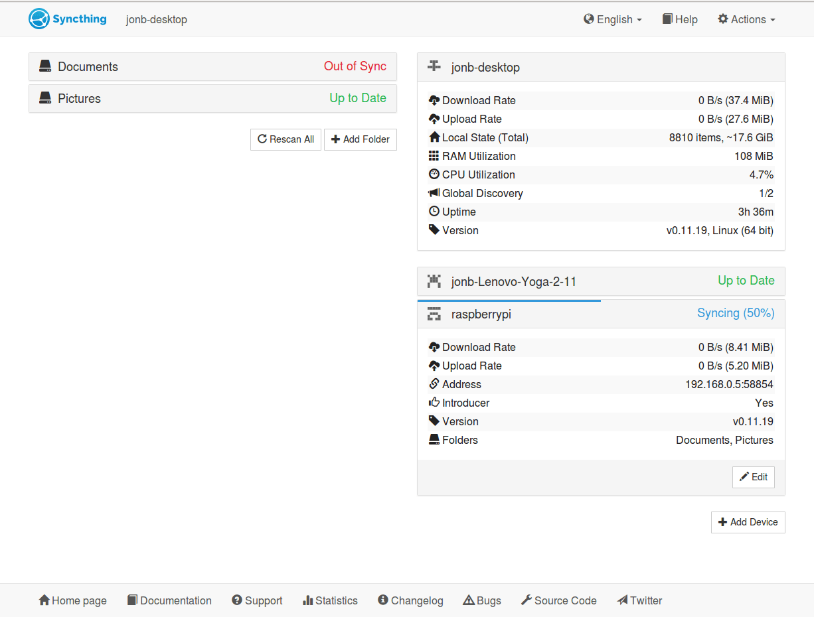

2013年，大学期间偶然的机会接触到Linux系统，当时第一次看到Backtrack，就被Linux系统所吸引，断断续续便完全抛弃了Windows。（这里说一下win确实有一个优秀的操作系统应用生态圈[**作者个人观点**]）在这几点年的时间里，我尝试了很多Linux发行版: Ubuntu, Fedora, Debian等。在这些系统中又尝试了很多种软件，这里根据自己的使用经验并结合网上的一些资料，对Linux下常用的软件进行整理，供大家参考，希望能帮助到大家。

这里首先推荐一个有**大队人马**陆续更新的Linux软件列表

[超赞的 Linux 软件](https://alim0x.gitbooks.io/awesome-linux-software-zh_cn/content/)

下述的就是我实际使用中**极力推荐**的软件

## 集成开发环境IDE
集成开发环境一般是集编辑，编译，链接，调试，版本管理和打包发布于一体的大型开发软件。它的特点是功能丰富，上手快，易操作。缺点也显而易见，笨重，运行速度慢，需要更多的CPU，内存资源。

- IntelliJ IDEA
- 
IntelliJ IDEA被认为是当前Java开发效率最快的IDE工具。它集成了开发过程中实用的众多功能，几乎可以不用鼠标可以方便的完成你要做的任何事情，最大程度的加快开发的速度。简单而又功能强大。与其他的一些繁冗而复杂的IDE工具有鲜明的对比。
[软件主页以及下载地址](https://www.jetbrains.com/)

- Eclipse
- 
是一个开放源代码的、基于Java的可扩展开发平台。就其本身而言，它只是一个框架和一组服务，用于通过插件组件构建开发环境。幸运的是，Eclipse 附带了一个标准的插件集，包括Java开发工具（Java Development Kit，JDK）。但是近几年使用人数在下滑，逐渐转向Android Studio和IntelliJ IDEA了。
[软件主页以及下载地址](http://www.eclipse.org)

- Android Studio
- 
是一个Android集成开发工具，基于IntelliJ IDEA. 类似 Eclipse ADT，Android Studio 提供了集成的 Android 开发工具用于开发和调试。
[软件主页以及下载地址](https://developer.android.com/studio/index.html)

## 文档查看
- Zeal

热情是一个软件开发离线文档浏览器。Zeal目前有195个很棒的文档！
[软件主页以及下载地址](https://zealdocs.org/)

## 文本编辑器
- Atom

Atom是由GitHub开发的自由及开放源代码的文字与代码编辑器，支持OS X、Windows和Linux操作系统，支持Node.js所写的插件，并内置由Github提供的Git版本控制系统。多数的延伸包皆为开放源代码授权，并由社区建置与维护。Atom基于Electron（最初以Atom Shell知名）和许可使用Chromium和Node.js的跨平台应用框架，并使用CoffeeScript和Less撰写。Atom也可当作IDE使用。被它的开发者称为“给21世纪的黑客风格编辑器（hackable text editor for the 21st Century）”。自2014年5月6日起，Atom的核心程序、包管理器以及Atom基于Chromium的桌面程序框架皆使用MIT授权条款发布。
[软件主页以及下载地址](https://atom.io/)

- Visual Studio Code

VS Code是一种新型工具，它结合了代码编辑器的简单性和开发人员在核心编辑构建 - 调试周期中需要的工具。代码提供全面的编辑和调试支持，可扩展性模型，以及与现有工具的轻量级集成。
[软件主页以及下载地址](http://code.visualstudio.com)

- Sublime Text

Sublime Text具有漂亮的用户界面和强大的功能，例如代码缩略图，Python的插件，代码段等。还可自定义键绑定，菜单和工具栏。Sublime Text 的主要功能包括：拼写检查，书签，完整的 Python API ， Goto 功能，即时项目切换，多选择，多窗口等等。Sublime Text 是一个跨平台的编辑器，同时支持Windows、Linux、Mac OS X等操作系统。
[软件主页以及下载地址](http://www.sublimetext.com/)

- haroopad

它是开源、免费、跨平台的，支持windows，linux和mac系统。Haroopad已经内置了各种markdown扩展，支持100多种编程语言代码的直接显示，例如C/C++， JAVA， C#， Ruby， Python， Erlang， Makefile等等，甚至代码显示的背景框都有很多主题可以选择。另外它支持撰写数学公式，支持一套文本绘图DSL，支持自动生成文档目录等等。Haroopad支持直接将文档发布成PDF格式。最后Haroopad支持用户自定义显示样式。
[软件主页以及下载地址](http://pad.haroopress.com/)

## 分析调试类

- Wireshark

老牌网络抓包利器，各种平台都可以玩耍。
[软件主页以及下载地址](https://www.wireshark.org/)

- tcpdump

这是一个命令行工具，可以看作是Wireshark的命令行版。
安装请 apt install

- Charles

网络抓包利器加上代理功能，并支持自签名证书，所以可以用来在手机上抓取https的包。使用非常方便。付费软件，值得购买。
[软件主页以及下载地址](https://www.charlesproxy.com/)

## 图片编辑器
对图片的简单处理也是很有必要的所以。。

- GIMP

GIMP 是跨平台的图像处理程序。GIMP 是 GNU 图像处理程序(GNU Image Manipulation Program)的缩写。GIMP 能够实现多种图像处理方面的要求，包括照 片润饰、图像合成和创建图像。
GIMP 有许多功能，它即可以作为简单的画图程序，也能作为专家级的照片处理程序,或在线批处理系统、或大批量图像渲染器，以及图像格式转换器等
安装请 apt install
[软件主页以及下载地址](http://www.gimp.org/)

## 版本管理
只能说版本管理是必须的。

- Git

Git 是个版本控制工具，运行速度快，最为出色的是合并追踪（merge tracing）能力。作为开源自由原教旨主义项目，Git 没有对版本库的浏览和修改做任何的权限限制，但可以通过其他工具达到有限的权限控制。
安装请 apt install

## 文件共享
从文件服务器(FTP, Samba etc.)下载资料或者上传文件到服务器上。

- FileZilla

FileZilla是一个免费开源的FTP软件，分为客户端版本和服务器版本，具备所有的FTP软件功能。可控性、有条理的界面和管理多站点的简化方式使得Filezilla客户端版成为一个方便高效的FTP客户端工具，而FileZilla Server则是一个小巧并且可靠的支持FTP&SFTP的FTP服务器软件。
安装请 apt install
[软件主页以及下载地址](https://sourceforge.net/projects/filezilla/)

- vsftp
vsftpd 是一个 UNIX 类操作系统上运行的服务器的名字，它可以运行在诸如 Linux, BSD, Solaris, HP-UX 以及 IRIX 上面。它支持很多其他的 FTP 服务器不支持的特征。
安装请 apt install

## 虚拟机&模拟器
兄弟们安装一个虚拟机运行QQ吧！

- VirtualBox

老牌虚拟机软件，支持市面上几乎所有流行的操作系统。
[软件主页以及下载地址](http://www.virtualbox.org/)

- Genymotion

安卓模拟器，运行安卓APP如同在手机上一样的速度。
[软件主页以及下载地址](http://www.genymotion.org）

- kvm

KVM（用于基于内核的虚拟机）是用于包含虚拟化扩展（Intel VT或AMD-V）的x86硬件上的Linux的完全虚拟化解决方案。它包含一个可加载的内核模块kvm.ko，它提供了核心虚拟化基础架构和一个特定于处理器的模块kvm-intel.ko或kvm-amd.ko。
[软件主页以及下载地址](https://www.linux-kvm.org/page/Main_Page）

## 翻墙利器
我要上谷歌搜索最新的Android开发文档和API，可是目前在国内用不了谷歌，怎么办？翻墙吧！

- Shadowsocks
利器不多说，Debian源里下载安装然后运行，配置，打开Chrome浏览器安装proxy-switchyomega，访问谷歌走你。。

- XX-net
XX-Net是一个免费的桌面应用程序，为被审查地区的用户提供快速，可靠和安全的访问开放互联网。它使用google app引擎（GAE）作为代理服务器通过防火墙。
[软件主页以及下载地址](https://github.com/XX-net/XX-Net)

- Lantern
如果上面两个不行，那么试试这个吧，Lantern是一个免费的应用程序，为被审查地区的用户提供快速，可靠和安全的访问开放互联网。它使用各种技术保持解锁，包括域前端，p2p和可插拔传输。
[软件主页以及下载地址](https://github.com/getlantern/lantern)

## 流程图
流程图是一种很有用的示意图，说明为获得一个问题的解决方案需执行的行为和操作顺序。流程图能促进程序员和业务人员之间的沟通。在问题的编程中流程图起到非常关键的作用，并在理解复杂和冗长问题的逻辑时非常有用。

- Dia

Dia图编辑器是免费的开源绘图软件Windows，Mac OS X和Linux。 Dia支持30多种不同图表类型，如流程图，网络图，数据库模型。超过一千个现成的对象有助于绘制专业图表。 Dia可以读取和写入许多不同的栅格和矢量图像格式。软件开发人员和数据库专家可以使用Dia作为CASE工具从其图纸生成代码框架。 Dia可以使用Python进行脚本化和扩展。
[软件主页以及下载地址](https://sourceforge.net/projects/dia-installer/)

- Freeplane

Freeplane是由经典思维导图软件FreeMind的主创人员设计的另外一款同类型工具，Freeplane已由官方汉化，功能比较齐全，相较于FreeMind也毫不逊色。
[软件主页以及下载地址](http://www.freeplane.org/)

## 远程链接
有什么比远程别人帮你解决问题更爽的，有什么比远程办公更装B的！

- AnyDesk

AnyDesk是一款号称速度最快的免费远程连接/远程桌面控制软件，据说是前 TeamViewer 开发小组人员自立门户的产品，它拥有先进的视频压缩技术 DeskRT， 可轻松穿透防火墙/路由器，实测在电信、移动的跨网宽带环境下，速度确实要比 TeamViewer 和 QQ 流畅。
[软件主页以及下载地址](http://anydesk.com/remote-desktop)

## 网盘 or Bt Sync or Download

- BT Sync

BT 下载，大家应该都很熟悉。开发 BT 的技术公司又发明了一个新的玩意，叫做 BT Sync，都是采用 P2P 协议来进行文件传输。简言之，BT Sync是一个文件同步工具，让你的文件不仅能够在自己的各个设备间传输，同时也能让你的文件夹通过加密手段传输给第三方。
[软件主页以及下载地址](https://www.resilio.com/)

- Syncthing

Syncthing是一个免费开源的工具，它能在你的各个网络计算机间同步文件/文件夹。它不像其它的同步工具，如BitTorrent Sync和Dropbox那样，它的同步数据是直接从一个系统中直接传输到另一个系统的，并且它是完全开源的，安全且私密的。
[软件主页以及下载地址](https://syncthing.net/)

- Dropbox

Dropbox是一款非常好用的免费网络文件同步工具，是Dropbox公司运行的在线存储服务，通过云计算实现因特网上的文件同步，用户可以存储并共享文件和文件夹。Dropbox提供免费和收费服务，Dropbox的收费服务包括Dropbox Pro 和 Dropbox for Business。在不同操作系统下有客户端软件，并且有网页客户端。
[软件主页以及下载地址](https://www.dropbox.com/)

- you-get
You-Get 乃一小小哒命令行程序，提供便利的方式，下载网络上的富媒体信息。
[软件主页以及下载地址](https://you-get.org/)

## 即时聊天

- Telegram

Telegram Messenger 是一个跨平台的即时通信软件，它的客户端是自由及开放源代码软件，但是它的服务器是专有软件。用户可以相互交换加密与自析构的消息，以及照片、视频、文件，支持所有的文件类型。官方提供移动端(Android、iOS、Windows Phone)、桌面端(Windows、macOS、Linux)和网页端(官方在线版)应用；同时官方开放应用程序接口，因此会有一些第三方的客户端。
[软件主页以及下载地址](https://telegram.org/)

- electronic-wechat-linux

一个Mac OS X 和 Linux 下更好用的微信客户端. 更多功能, 更少bug. 使用Electron构建.
[软件主页以及下载地址](https://github.com/geeeeeeeeek/electronic-wechat)

## 创建图书
- GitBook

GitBook可用于创建图书，公共文档，企业手册，论文，研究论文等。是使用GitHub or Git和Markdown（或AsciiDoc）构建漂亮书籍的命令行工具（和Node.js库）。
[软件主页以及下载地址](https://github.com/GitbookIO/gitbook)

## 博客框架
- Hexo

Hexo 是一个快速、简洁且高效的博客框架。 Hexo 使用Markdown（或其他渲染引擎）解析文章，在几秒内，即可利用靓丽的主题生成静态网页。
[软件主页以及下载地址](https://hexo.io/zh-cn/)

## 录像和直播
- OBS Studio

免费和开源软件，用于录像和直播。在Windows，Mac或Linux上快速，轻松地下载并开始流式传输。
[软件主页以及下载地址](https://obsproject.com/)

