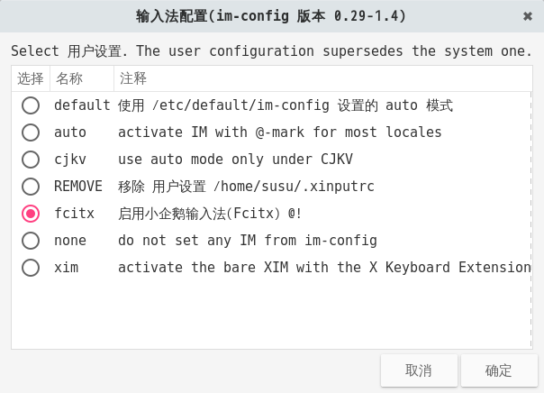

## Fcitx

Fcitx (Flexible Input Method Framework) ──即小企鹅输入法，它是一个以 GPL 方式发布的输入法平台(即原来的 G 五笔)，包括五笔、拼音(全拼和双拼)、二笔、区位等输入模块，支持简入繁出，是在 Linux 操作系统中常用的中文输入法。它的优点是，短小精悍、跟程序的兼容性比较好。

### 安装Fcitx
打开终端输入下面的命令
> sudo apt-get install fcitx fcitx-module-cloudpinyin fcitx-googlepinyin im-config

	**注意**:如果需要安装五笔等输入法请将fcitx-googlepinyin 替换为需要的输入法模块,例如fcitx-table-wbpy(五笔打字)等.

然后在终端中输入下面的命令打开输入法配置
> im-config

点击OK按钮，再点击Yes按钮，将fcitx设为默认的输入法框架，最后点击OK.

然后重启Gnome.
重启成功以后你就会fcitx的小图标出现在任务栏上了.

### 安装Ibus
暂无

### 安装搜狗拼音

首先去搜狗官方网站下载deb软件包，然后进入下载目录,在终端执行安装

> sudo dpkg -i sogoupinyin_2.0.0.xxx_amd64.deb

然后修复依赖关系
> sudo apt-get install -f

然后和安装fcitx一样，执行im-config选择fcitx重启即可。

### 故障排除

#### 首先诊断问题所在
当你遇到任何 fcitx 有关的问题，比如 ctrl+space 在有的程序中不能工作，首先应该用 fcitx-diagnose 命令诊断问题的原因。 fcitx-diagnose 会列出所有 fcitx 正常运行所需的前提条件，从输出结果中通常可以找到问题的原因。 在网上（比如在 irc 或者论坛里）询问别人关于 fcitx 配置的问题时，也请首先提供你的 fcitx-diagnose 输出结果（比如贴到 pastebin 服务），这将加速别人帮你找到问题所在.
#### 没有ui,导致fcitx不能使用,或使用ctrl+space不能切换
1. 安装fcitx-ui-classic
> sudo apt-get istall fcitx-ui-classic

2. 注销当前用户,在Gdm3登录界面点击自己的用户名,有一个设置按钮(图标形式存在),点击他选择Gnome默认.(这是因为你选择了Gnome-wayland,fxitx暂时不支持wayland).
3. 卸载所有fcitx相关,重新安装.
执行下面两条命令后移除fcitx软件包后,安装安装所写过程,重新安装.
> sudo apt purge fcitx*
sudo apt autoremove

#### fcitx中文乱码,麻将字
请参阅Fonts章节.

