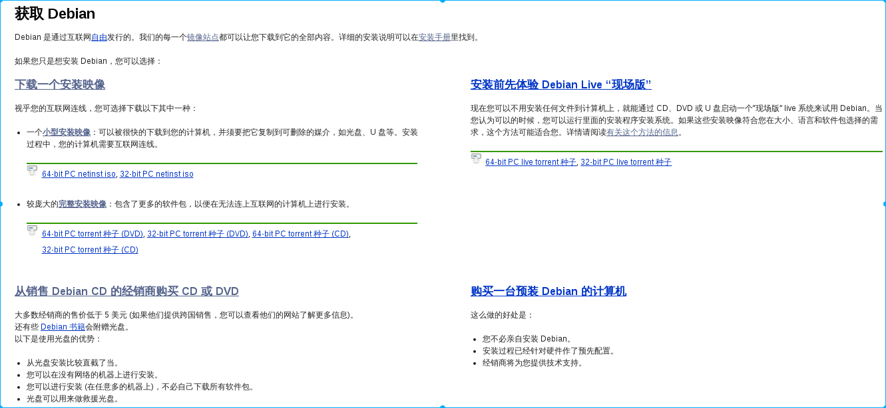
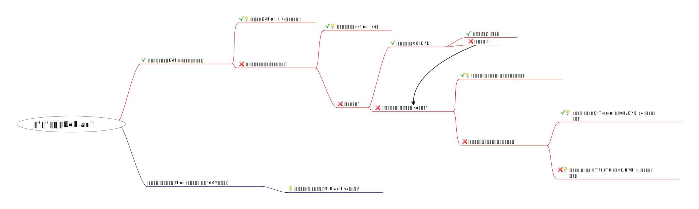

## 获取debian
<!-- toc -->
Debian 是通过互联网**自由**发行的。我们的每一个[镜像站点](https://www.debian.org/mirror/list)都可以让您下载到它的全部内容。

您可以选择这里获取Debian[戳我](https://www.debian.org/distrib/)
您打开上述网页后看到的应该是这样的,但是该如何选择呢?

### 我该如何选择

如果您想安装 Debian，作者推荐使用以下方式**选择**一种方式安装Debian：

**注:右键新标签页打开图片可查看高清图**
### 详细介绍每种方式
通过上图您一定能选择出一种适合您的Debian安装方式,下面就详细介绍下每一种安装方式.
#### iso文件名命格式
首先要说明的是Debian iso文件的命名格式：
> debian-mac-8.6.0-amd64-xfce-cd-1.iso
文件命令以\-为分割线

- **Debian**：发行版名称
- **mac**：mac是netinst专有的，是在旧的64-bit Intel Macintosh 机器上专门针对性的一个特殊版本。它可以在大多数其他amd64机器上工作，但它不包含有些人所需要UEFI启动文件。
- **8.6.0**：表示此iso文件的版本，如：testing，8.6.0，7.9.0等。
- **amd64**：表示此iso文件适用于64位机器，由于Debian支持很多平台，所以常见的有i386，arm，x86-64等。
- **xfce**：表示此iso文件中包含桌面环境为xfce的deb包。常见的有Gnome，Kde，lxde。
- **CD**：表示此iso文件是一个cd版本，除了CD还有DVD，netinst，BD等。
- **1**：表示镜像文件的编号。

DVD/CD有很多张镜像文件，在大多数情况下没有必要下载所有镜像文件，只需要下载编号为1的镜像以便能够在您的计算机上安装Debian。
#### CD/DVD/netinst/live到底是什么
- **CD/DVD**：给自己的计算机安装过系统的同学应该知道，安装系统是可以通过光驱的，既然能通过光盘，那么自然有CD/DVD了，它们的区别在于单张CD容量小约650MB，一般镜像文件编号较大，安装的Debian桌面环境为精简版。而单张DVD能存储的东西多约4.4GB。安装的Debian桌面环境为完整版。
- **netinst**：网络安装版本,就是只能通过联网安装，大小为300MB，优势在于轻便，但是自己网速不稳定的情况下不建议使用，因为这种网络安装程序需要网络连线，可能是通过以太网络 (Ethernet) 或是无线网络 (有可能是通过笔记本计算机中的 PCMCIA 网卡)下载安装。
- **Live cd**：又译为自生系统，是事先存储于某种可移动存储设备上，可不特定于计算机硬件（non-hardware-specific）而启动的操作系统（通常亦包括一些其他软件），不需安装至计算机的本地外部存储器 - 硬盘。采用的介质包括CD-ROM（Live CD），DVD（Live DVD），闪存盘（Live USB）甚至是软盘等。退出自生系统并重启后，电脑就可以恢复到原本的操作系统。自生系统的运作机制，是通过“把原本放在硬盘里的文件，放到存储器的虚拟磁盘中”来运作；因此系统存储器愈大，则运行速度愈快。

现在您对获取Debian的相关知识有了一定的了解,现在您要做的就是点击下面链接下载镜像文件.
http://cdimage.debian.org/cdimage/

**stable**：http://cdimage.debian.org/cdimage/release/

**stable current live**：http://cdimage.debian.org/debian-cd/current-live/

**testing（每周生成版）**：http://cdimage.debian.org/cdimage/weekly-builds/

点击上述链接后手动选择对应版本和架构三部曲：

1. 点击想下载的版本，如testing，8.6.0（stable）。
2. 点击与你计算机架构相对于的连接（比如我的笔记本是64位的，我就选择amd64）。
3. 点击iso-cd/iso-dvd/bt-cd/bt-dvd/  这里根据自己所需下载对应iso（**cd目录下包含netinst版本，bt目录下包含种子文件**）。

**注意**：stable或testing的选择上往往大家都有不同的看法，作者推荐日常桌面环境请使用testing/sid，服务器请使用stable，至于大家如何选择那就仁者见仁，智者见智了。