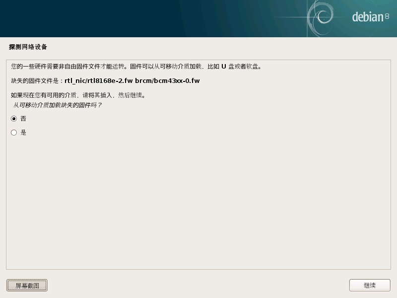

## Debian 安装时提示缺少固件

有些时候选Graphic Installer，很快就进入到界面，发现安装过程需要手动提供名为 XXXX.**fw** 的**固件**，如下图所示.是因为在某些情况下，安装程序检测对**非自由固件**的需要，并提示用户使固件提供给安装程序来完成安装.

### 固件是什么

固件是一个软件程序或一组程序的硬件设备上的指令。它提供了设备如何与其它计算机硬件进行通信的必要指令。